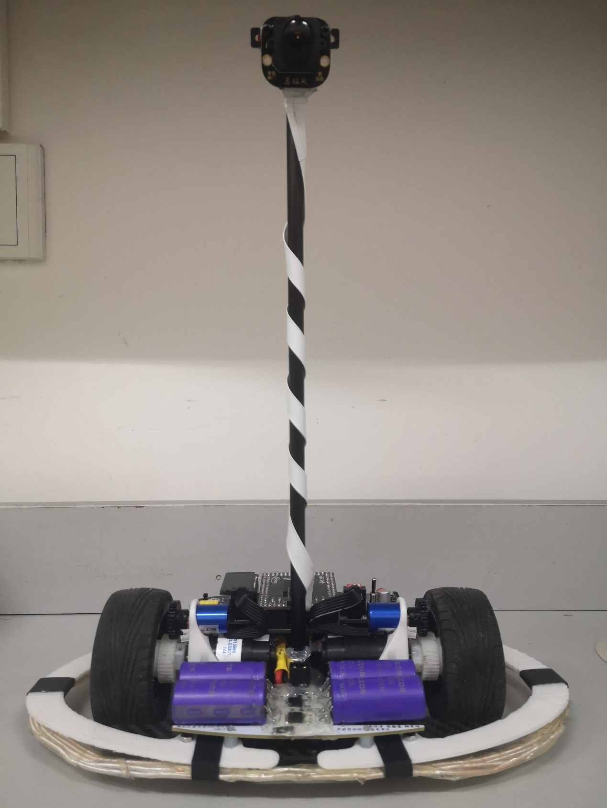

# Wireless Beacon

湖北工业大学 - 蓝电零队
第十六届全国大学生智能汽车竞赛 - 节能信标组  
  
校赛(第一名) -> 华南赛区(第二名) -> 国赛(第二十名)
  
---

---

### Version Description

* **Ver.4_8203**  
   * ***国赛代码***

* **Ver.4_8202**  
   * 优化 *Controller* 速度决策全改为位置外环
   * 优化 *RUN* 速度决策参数
   * ***国赛前代码 - 可灭56个灯***

* **Ver.4_8202**  
   * 优化 *Controller* 速度决策全改为位置外环
   * 优化 *RUN* 速度决策参数
   * ***国赛前代码***

* **Ver.4_8201**  
   * 优化 *RUN* 速度决策参数
   * ***国赛前代码***

* **Ver.4_8191**  
   * 新增 *MT9V034* 去畸变模式
   * 优化 *RUN* 速度决策参数
   * 修复 *RUN* 角度P过大

* **Ver.4_8163**  
   * 修改 *Flag* 各标志位为_Bool类型
   * 优化 *RUN* 停车充电

* **Ver.4_8162**  
   * 优化 *RUN* 速度决策参数
   * 新增 *RUN* 超时停车

* **Ver.4_8161**  
   * 优化 *RUN* 速度决策参数
   * 优化 *Controller* 最大速度取消占空比限制

* **Ver.4_8152**  
   * 优化 *RUN* 速度决策参数
   * 优化 *Charge* 电压电流数据取一位小数

* **Ver.4_8151**  
   * 优化 *RUN* 速度决策参数
   * 优化 *PID* 定点停车位置环参数
   * 新增 *RUN* 无限续杯！
   * 新增 *Motor* 控制器定时
   * 修复 *Looking* 连通域边界错误

* **Ver.4_8131**  
   * 优化 *RUN* 速度决策参数
   * 优化 *PID* 定点停车位置环参数

* **Ver.4_8131**  
   * 优化 *RUN* 速度决策
   * 优化 *PID* 各参数

* **Ver.4_8121**  
   * 移除 *Looking* 子连通域链表

* **Ver.4_8111**  
   * 新增 *Looking* 子连通域链表
   * 修正 *MT9V034* 宏定义名称
   * 修复 *Motor* 引脚错误
   * 移除 *Looking-CON* 数组

* **Ver.4_8102**  
   * 新增 *PID_Location* 位置环
   * 优化 *RUN-Flag* 标志位
   * 移除 *RUN* 跑车逻辑 - 重写 

* **Ver.4_8101**  
   * 新增 *PID_Location* 位置环
   * 新增 *Looking-Undistort* 摄像头图像去畸变
   * 新增 *Motor* 电机驱动STBY使能

* **Ver.4_8032**  
   * 新增 *Looking* 求连通域边长
   * 新增 *Looking* 求连通域圆形度
   * 优化 *UI* 界面字符位置
   * 修改 *IPS114* 显示字符位置

* **Ver.4_8031**  
   * 国赛代码准备阶段

* **Ver.4_7241**  
   * 国赛代码准备阶段

* **Ver.4_7211**  
   * 国赛代码准备阶段

* **Ver.3_7210**  
   今年节能信标组赛题较为离谱，信标灯也是很晚才出，所以准备的时间不太多，比赛前又临近期末，很多问题都没解决。所幸运气较好，赛前几天将主要问题逐一解决，成功完赛。  
   我认为今年节能信标组主要问题在车模。车模可以自制，尺寸不限，所以只有想不到的，没有做不出来的，群里很多大佬都提出了很多离谱的想法。我们组还是决定以两轮差速为主，一个万向轮为辅为主要方向。  
   emmm......  不想写了，玩去了，如果有任何问题的话欢迎与我交流(QQ:1519300884)  

   > ***华南赛区第二名***

* **Ver.3_7192**
   * 优化 *Connectivity* 连通域连续判断
   * ***华南赛代码***

* **Ver.3_7191**
   * ***华南赛代码***

* **Ver.3_7183**
   * 优化 *ui_Run* 各车速决策判断
   * 优化 *ui_Run* 停车逻辑
   * ***华南赛区预赛后调节二***

* **Ver.3_7182**
   * 优化 *Looking* 坐标柔和变化
   * 优化 *ui_Run* 各车速决策判断
   * 修改 *MT9V034* 禁用中断嵌套
   * 修改 *MT9V034* 摄像头分辨率
   * ***华南赛区预赛后调节一***

* **Ver.3_7181**
   * 优化 *ui_Run* 各车速决策判断
   * ***华南赛区预赛前代码***

* **Ver.3_7171**
   * 优化 *ui_Run* 各车速决策判断
   * ***去往华南赛区前半小时的代码***

* **Ver.3_7163**
   * 优化 *ui_Run* 停车充电
   * 优化 *ui_Run* 车速参数
   * 新增 *Controller* 最大占空比限制

* **Ver.3_7162**
   * 优化 *Looking* 寻灯判断逻辑
   * 优化 *MT9V034* 区域限制
   * 优化 *ui_Run* 跑车算法
   * 新增 *ui_Run* 停车充电算法
   * 新增 *Looking* 坐标柔和变化
   * 修复 *Mode* 模式选择

* **Ver.3_7161**
   * 新增 *Looking* x坐标柔和变化
   * 新增 *Buzzer* 蜂鸣器
   * 新增 *ui_Motor* 车速模式
   * 修复 *Mode* 模式选择

* **Ver.3_7153**
   * 优化 *Looking* 横行三点判别法
   * 修复 *Looking* 连通域逻辑错误

* **Ver.3_7152**
   * 新增 *Mode* 模式选择 阈值及寻灯模式
   * 优化 *ui_Run* 跑车逻辑

* **Ver.3_7151**
   * 新增 *Controller* 速度表
   * 新增 *Looking* 限幅大津法双峰
   * 新增 *Wireless* VOFA+上位机
   * 优化 *Looking* 寻灯算法

* **Ver.3_7142**
   * 优化 *ui_Motor* 跑车调试
   * 优化 *Controller-PID* 参数 

* **Ver.3_7141**
   * 优化 *PID* 参数
   * 优化 *PID* 控制器逻辑
   * 优化 *isr-Motor* 电机控制中断及中断优先级
   * 优化 *ui-Motor* 界面逻辑
   * 优化 *Looking* 寻灯判断
   * 移除 *Controller* 跳动限制

* **Ver.3_7132**
   * 优化 *ICM42605* 初始化
   * 优化 *MT9V034* 摄像头图像获取及处理
   * 优化 *UI-Run* 跑车逻辑
   * 新增 *IMAGE-ignore* 图像处理忽略行
   * 移除 *ICM_Data* 效果较差，原始数据足够

* **Ver.3_7131**
   * 优化 *Looking* 连通域条件
   * 新增 *Controller* 陀螺仪数据修正
   * 新增 *Controller* PWM大幅度变化限制

* **Ver.3_7123**
   * 优化 *PID* 控制器
   * 优化 *kI* 调参幅度

* **Ver.3_7122**
   * 优化 *PID* 控制器
   * 优化 *kI* 调参幅度

* **Ver.3_7121**
   * 优化 *Controller* 运行控制

* **Ver.3_7111**
   * 优化 *Controller* 运行控制
   * 优化 *Loogking* 特征连通域判断
   * 优化 *UI-Motor* 电机调参
   * 新增 *ICM* 数据异常重新初始化
   * 修复 *Motor* 编码器引脚错误

* **Ver.3_7081**
   * 优化 *Controller* 运行控制
   * 优化 *ICM* 初始化及数据获取
   * 优化 *Mode* 模式选择
   * 新增 *Run* 简易跑车
   * 新增 *IPS* 屏幕关闭
   * 新增 *Charge* 最小电压设置
   * 移除 *Loogking* 连通域条件
   * 移除 *ICM* 加速度数据获取
   * 移除 *Connectivity* 列行完整判断

* **Ver.3_7052**
   * 优化

* **Ver.3_7051**
   * 优化

* **Ver.3_7041**
   * 优化

* **Ver.3_7032**
   * 优化 *Looking* 连通域检测

* **Ver.3_7031**
   * 优化 *IMAGE* 图像处理互斥
   * 优化 *CPU* 多核处理
   * 修改 *IMAGE* 由 *CPU1* 计算
   * 修改 *MOTOR* 由 *CPU2* 计算

* **Ver.3_7023**
   * 移植 *Connectivity* 至 *TC377*
   * 优化 *Looking* 寻灯

* **Ver.3_7022**
   * 修改 *Looking* 寻灯 - 待完赛

* **Ver.3_7021**
   * 优化 *Connectivity* 连通域已实现

* **Ver.3_6292**
   * 新增 *Connectivity* 连通域

* **Ver.3_6291**
   * 优化

* **Ver.3_6281**
   * 新增 *Speed* 车速计算
   * 优化 *ICM42605* 数据获取

* **Ver.3_6271**
   * 优化

* **Ver.3_6222**
   * 新增 *PID_Velocity* 速度环PID
   * 新增 *IPS114_Draw_Rectangle* IPS屏幕画框
   * 新增 *ui_parm* UI调参
   * 优化 *ui* 各级界面

* **Ver.3_6221**
   * 优化 *TC377*

* **Ver.3_6161**
   * 移植 *TC212->TC377*

* **Ver.3_6051**
   * 新增 *TC377-ICM_Data*
   * 新增 *TC377-ICM20602*
   * 新增 *TC377-MT9V034*
   * 新增 *TC377-IPS114*
   * 新增 *TC377-Scheduler*
   * 新增 *TC377-Wireless*
   * 新增 *TC377-gpio*

* **Ver.3_6011**
   * 更名 *Beacon* --> *Beacon_TC264*
   * 新增 *Beacon_TC377*
   * 升级 *Ver.3*

* **Ver.2.2_5102**
   * 更新 *Seekfree Library TC264* 逐飞库

* **Ver.2.2_5101**
   * 转移 *TC264* 代码至 *TC212*

* **Ver.2.2_5082**
   * 优化 *Controller* 控制代码逻辑
   * *** 校赛代码 ***

* **Ver.2.2_5081**
   * 新增 *Charge* 最大充电电压调参
   * 移除 *~~UI->Parameters~~* 调参向导

* **Ver.2.2_5071**   **_Milepost_**
   * 优化 *ui->Run* 跑车控制逻辑
   * 优化 *Controller* 跑车控制逻辑
   * 新增 *Controller* 过灯检测
   * 降低 *Charge* 最小充电电压
   * *** 完赛 ***

* **Ver.2.2_5062**
   * 优化 *isr* 充电、控制定时器合并
   * 移除 *~~OSTU~~* 大津法阈值
   * 待优化：*停车充电*
   * 待优化：*跑车速度*
   * 待优化：*灭灯效率*
   * 待优化：*调参向导*
   * *** 完赛 ***

* **Ver.2.2_5061**
   * 新增 *Parameters* 调参向导
   * 修改 *Charge* 最大最小目标电压为变量
   * 修改 *MT9V03X* 摄像头调试板
   * 移除 *OSTU* 大津法阈值

* **Ver.2.2_5051**
   * 优化 *Run* 停车充电
   * 新增 *Charge* 停车充电目标电压
   * 新增 *MT9V034* 阈值增幅
   * 提高 *Charge* 最小电压 *5.0V*

* **Ver.2.2_5042**
   * 新增 *MT9V304* 摄像头平均阈值增幅
   * 优化 *Run* 跑车逻辑
   * 魔改 *OSTU* 大津法阈值
   * 移除 *Encoder* 电机编码器注释等
   * ***成功完赛***
   * *** 1分30秒 20灯 ***

* **Ver.2.2_5041**
   * 新增 *Motor* 制动功能
   * 新增 *OSTU* 大津法阈值
   * 修改 *MT9V304* 摄像头分辨率 ***188x120***
   * 修改 *Buzzer* 蜂鸣器标志位
   * 优化 *Run* 停车充电功能
   * ***停车完成***

* **Ver.2.2_5032**
   * 修改 *Charge* *CPU0* 处理中断
   * 修正 *isr-Motor* 寻灯前行分离
   * 移除 *RUN* ***CPU1*** 逻辑代码
   * 移除 *RUN* 逻辑代码
   * ***停车验证***

* **Ver.2.2_5031**
   * 升级 *ADS 1.4.0*
   * 合并 *Controller*
   * 优化 *Motor* 停车
   * 修正 *Charge* 目标电压（暂时）
   * 修正 *Parameters* *PID*调参
   * 添加 *RUN* 跑车逻辑
   * 添加 *UI—Run* 跑车界面逻辑

* **Ver.2.2_4301**
   * 完善 ***Run*** 跑车代码
   * 新增 *Looking* 平均阈值算法
   * 新增 *Charge* 最低充电电压
   * 新增 *CPU1* 跑车模式
   * 修正 *CPU0* 模式选择
   * 移除 *MPU9250* 使能
   * 移除 *~~.~~* 部分无用代码及注释
   * 优化部分代码
   * ***完赛验证***

* **Ver.2.2_4293**
   * 优化部分代码
   * **可以跑车**

* **Ver.2.2_4292**
   * 修正 *Controller* 电机控制逻辑
   * 修正 *UI* 电机控制界面逻辑
   * 优化 *isr* 摄像头中断优先级
   * 移除 *CPU1* 摄像头采集
   * 移除 *isr* 摄像头中断嵌套

* **Ver.2.2_4291**
   * 新增 *CPU1_Main* 控制
   * 优化 *Looking* 
   * 优化 *Controller* 
   * 修正 *Motor_Freq* 电机PWM频率
   * 修正 *TC212-Charge* 电压采样精度
   * 修改 *isr* 修改中断参数
   * 移除 *Charge* 充电限制
  
* **Ver.2.2_4281**
   * 添加 *PID_YAW* 角度，角速度PID
   * 添加 *Controller* 串级角度环
   * 优化 *MPU_Data* 陀螺仪角速度精度
   * 修改 *PIT* 中断优先级
   * 修改 *UI_Motor* 电机调参UI
   * 移除 *Encoder* 电机编码器

* **Ver.2.2_4272**
   * 优化 *MPU9250* 
   * 优化 *MPU_Data* 陀螺仪数据校准
   * 新增 *Backup* 备份区
   * 移动 *~~AHRS~~* 至 *Backup*
   * 移动 *~~MPU6050~~* 至 *Backup*
   * 移动 *~~rowData~~* 至 *Backup*
   * 移除 *~~WT931~~*

* **Ver.2.2_4271**
   * 新增 *MPU6050* 
   * 新增 *MPU9250* 
   * 新增 *AHRS* 互补融合
   * 新增 *rowData* 陀螺仪校准

* **Ver.2.2_4262**
   * 新增 *IIC* 控制代码
   * 电机控制代码规范 *_1*->*_R*, *_2*->*_L*

* **Ver.2.2_4261**
  * *TC212* 主控修改为无线充电测试板
  * *TC212* 主控新增充电平均功率
  * *TC264* 主控新增充电平均功率

* **Ver.2.2_4251**
  * 规范注释 //>中文, // English
  * 无线充电傻充，注释无用代码

* **Ver.2.2_4241**
  * 优化 *Controller* 代码
  * 添加 *Wireless Debug* 使能

* **Ver.2.2_4222**
  * 更新 *Controller* 代码
  * 优化电机控制

* **Ver.2.2_4221**
  * 修复寻找信标灯导致的单片机复位

